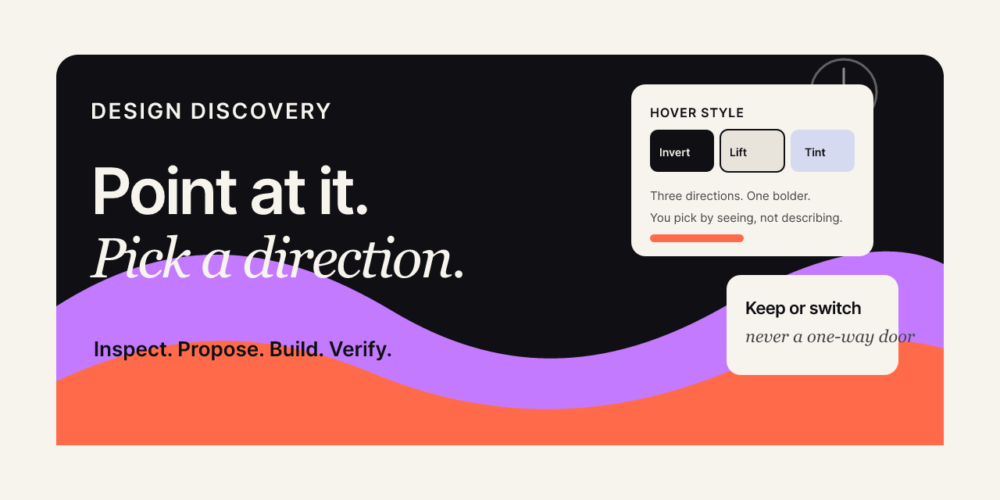
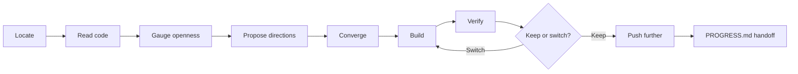

<p align="center">
  
</p>

<h1 align="center">Design Discovery</h1>

<p align="center">
  <strong>The creative director skill for vibe coders.</strong><br>
  Turn a vague <em>"make this cooler"</em> into concrete directions you can pick by seeing — then build, verify, and switch without starting over.
</p>

<p align="center">
  <a href="https://docs.claude.com/en/docs/claude-code"></a>
  <a href="./LICENSE"></a>
  <a href="#contributing"></a>
  <a href="https://github.com/MilkDeLeche/Design-Discovery/stargazers"></a>
</p>

---

## Part of the vibe coder's utility belt

Design skills for people who ship fast with AI — and still want the result to feel *designed*, not generated.

| Skill | Role | Repo |
| --- | --- | --- |
| **Design Discovery** ← you are here | Broad creative director — inspect, propose directions, build, verify | [Design-Discovery](https://github.com/MilkDeLeche/Design-Discovery) |
| **[FontPlaybook](https://github.com/MilkDeLeche/FontPlaybook)** | Typography specialist — audit, pair, load, scale, industry-fit type | [FontPlaybook](https://github.com/MilkDeLeche/FontPlaybook) |

**Design Discovery** handles layout, motion, composition, and open-ended polish. When the problem is specifically fonts, hierarchy, or loading — it delegates to **FontPlaybook** instead of guessing at Google Fonts.

---

## The problem

You're vibe coding. You point at a card grid and say *"make these hoverable."*

The AI either guesses wrong, or asks you to *"describe the animation you envision, including start and end states."* — and now **you** are doing the design thinking you opened the AI to avoid.

You don't always know what you want. You just know the current thing isn't it.

## The fix

**Design Discovery** is a **discoverer**, not a clarifier.

A clarifier pins down what you already had in mind. A discoverer expands what you thought was possible — *then* converges and builds it.

> You react to options far more creatively than you generate from a blank page. This skill supplies the options.

It reads your **real code first** — tokens, neighbors, conventions — then holds up a few concrete directions. Always one bolder than you asked for. You pick by *seeing*, not spec-writing.

<table>
<tr>
<td width="50%" valign="top">

**Without the skill**

```
You: "make these cards hoverable"

AI: "What kind of hover? Describe
     the transition, easing, and
     end state you want."

You: 😶
```

</td>
<td width="50%" valign="top">

**With Design Discovery**

```
You: "make these cards hoverable"

AI: "Three directions for these
     four service cards — invert,
     lift + shadow, or quiet tint.
     Here's what each feels like."

You: *clicks Invert* → it ships
```

</td>
</tr>
</table>

---

## See it work

You point at four service cards: **"make these hoverable, with a highlight."**

The skill reads the cards, sees they have no hover state, and offers:

```
┌─ Hover style ───────────────────────────────────────────┐
│                                                          │
│  ① Invert (dark fill)     ② Lift + shadow    ③ Tint     │
│  ┌──────────┐             ┌──────────┐      ┌─────────┐  │
│  │ ███ ELEC │ ← dark on   │ accent   │ ↑    │ ▓▓ ELEC │  │
│  │ ███ light│   hover     │ ELEC     │ lift │ ▓▓ tint │  │
│  └──────────┘             └──────────┘      └─────────┘  │
│                                                          │
└──────────────────────────────────────────────────────────┘
```

You pick **①**. It builds the invert hover — matching your existing CSS variables and easing — verifies it against *those specific cards*, and offers a `prefers-reduced-motion` guard.

No blank-page paralysis. No pixel essay. You pointed; it shipped.

---

## The loop



| Step | What happens |
| --- | --- |
| **Locate** | Find the actual element, section, or file you meant |
| **Read** | Inspect tokens, conventions, and neighbors before proposing anything |
| **Gauge** | Trivial + specific? Just do it. Open-ended? Open the option space |
| **Propose** | Distinct directions with previews — one bolder than asked, exits always available |
| **Converge** | Expand once, then commit. No endless interrogation |
| **Build** | Implement in your house style; lean on expert skills where installed |
| **Verify** | Check the result against the *specific* element you pointed at |
| **Keep or switch** | Re-offer the directions you didn't pick — choices stay reversible |
| **Handoff** | On wrap-up, update `PROGRESS.md` so the next session resumes cold |

---

## What makes it different

These guardrails keep it useful instead of annoying:

| | Principle | What it means |
| ---: | --- | --- |
| 🔙 | **Choices stay reversible** | After it builds, it re-offers the other directions. Picking one never buries the rest. |
| 🚪 | **Always an off-ramp** | *"I'll take it from here"* and *"Let's talk it through"* are always reachable — but real options come first. |
| 🏠 | **Borrow ideas, build in house style** | Research external patterns for structure; execute 100% in your tokens, type, and components. Nothing looks transplanted. |
| 🧠 | **Stands on expert skills** | Animation → official GSAP skills. Typography → [FontPlaybook](https://github.com/MilkDeLeche/FontPlaybook). Says which one it's using. |
| 🧭 | **Leaves a breadcrumb** | Wrap-up updates `PROGRESS.md` in place — goal, done, what's left, how to resume. |

---

## Example prompts

```text
"what can we do with the nav?"
```

```text
"make these cards hoverable"
```

```text
"this hero looks bland — help me figure out what I want"
```

```text
/design-discovery make my footer feel premium
```

It **skips the funnel** for trivial, fully-specified tweaks — so it never blocks you when you already know exactly what you want.

---

## Works on anything

Grounded in *your* code — not tied to one stack.

| | |
| --- | --- |
| **Any element** | a `<div>`, nav, card grid, hero, whole section |
| **Any framework** | React · Vue · Svelte · Astro · plain HTML |
| **Any styling** | Tailwind · vanilla CSS · CSS variables · styled-components |
| **Any surface** | Claude Code terminal · VS Code · JetBrains · Cursor · web |

Point at a thing. Ask *"what can we do here?"* It figures out the rest from what's on the page.

---

## Install

### Claude Code (recommended)

```bash
# Global — every project
git clone https://github.com/MilkDeLeche/Design-Discovery.git \
  ~/.claude/skills/design-discovery
```

| Scope | Path |
| --- | --- |
| **Global** | `~/.claude/skills/design-discovery/` |
| **Per-project** | `<your-project>/.claude/skills/design-discovery/` |

> **Windows:** `C:\Users\<you>\.claude\skills\design-discovery\`

Restart Claude Code (or Cursor) after installing.

### Cursor / other agents

Clone the repo into whatever skills directory your setup reads. The entrypoint is [`SKILL.md`](./SKILL.md).

---

## Repo structure

```text
Design-Discovery/
├── SKILL.md              # Core agent workflow (the skill itself)
├── README.md             # You are here
├── LICENSE
└── assets/
    ├── design-discovery-banner.png   # README banner (GitHub does not render SVG in README)
    └── design-discovery-banner.svg   # Editable source
```

---

## Portfolio note

This repo is a **showcase piece** as much as a tool: a focused example of turning design taste into reusable AI behavior.

The goal isn't another generic "make it pretty" prompt. It's a **structured creative director** that vibe coders can drop into their utility belt — inspect real code, surface directions you'd never have described, build in the project's own language, and leave a handoff when the session ends.

Built by [MilkDeLeche](https://github.com/MilkDeLeche) for the vibe coding community.

---

## Roadmap

- [ ] Before/after case studies from real client projects
- [ ] Framework-specific walkthroughs (Tailwind, React, Next.js)
- [ ] Video/GIF demos of the direction-picker flow
- [ ] Deeper integration docs for the FontPlaybook + GSAP skill stack
- [ ] A tiny demo page showing the same component with different discovered directions

---

## Contributing

PRs welcome — new question patterns, better previews, smarter scope detection, real case studies.

Open an issue or pull request.

## License

[MIT](./LICENSE) © [MilkDeLeche](https://github.com/MilkDeLeche)
